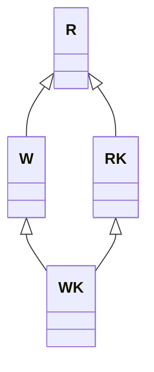
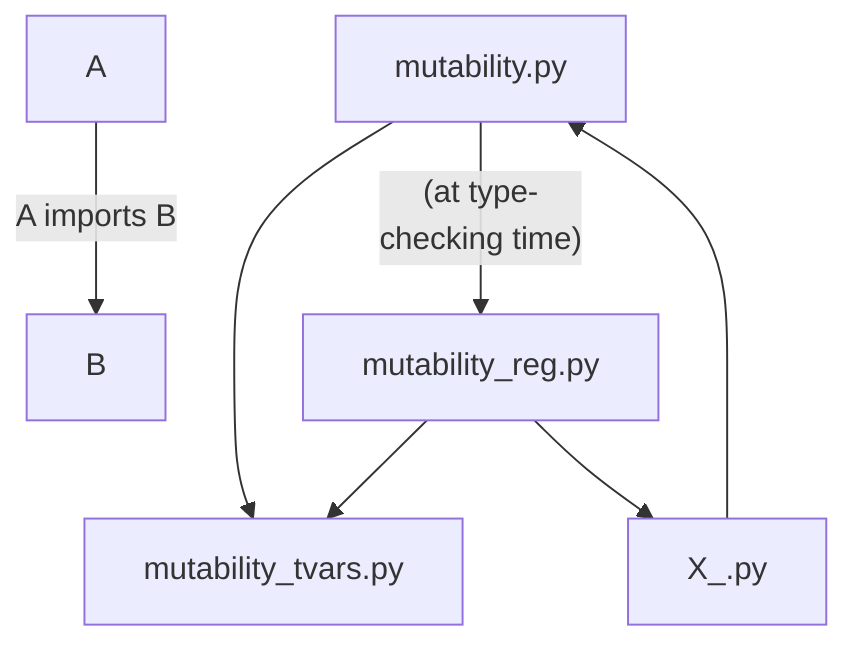

# Mutability

**IMPORTANT:** The code was developed and tested *only* in Visual Studio Code with Pylance/Pyright.

## The Problem

Mutability is something I think about all the time when I program and I always feel frustrated by not being able to express what I want through the type system.

Even though Python's community believes mutability should be limited, Python doesn't have good support for *pure programming*. In particular, it's neither *expression-oriented* nor does it have native support for *persistent collections*.

I don't think mutability should be avoided at all costs, but I'd like to have some way to control it through *static types*.

For instance, let's say I have a list and want to initialize an object with it:

```python
class A[T]:
    xs: list[T]

    def __init__(self, xs: list[T]) -> None:
        self.xs = xs
    
    ...
```

That code is problematic as both `A` and the caller might modify the list afterward.

The recommended alternative is probably the following:

```python
class A[T]:
    xs: list[T]

    def __init__(self, xs: Iterable[T]) -> None:
        self.xs = list(xs)
    
    ...
```

That doesn't solve the problem, though:

1. copying the list or keeping the copy might be too expensive
2. the caller and `A` might actually want to share the same list

One could also use standardized *ABCs* such as `Sequence`, but they widen the types too much as they are *abstract* not only *technically* but also *conceptually*. To "cover" a concrete type, one would need to employ several *traits*, which tends to complicate the code, in my opinion.

## A Solution

I implemented a simple mechanism that works at *type-checking time* and has a negligible runtime cost, just like a `cast` call. Here's what the previous code looks like using my approach:

```python
class A[T]:
    xs: list_[T, RK]

    def __init__(self, xs: list_[T, RK]) -> None:
        self.xs = xs

    ...
```

`list_` is just a regular `list` at run-time. The parameter `RK` means "read - keep", that is, `A` can *keep* `xs` in *read-only mode*.

The "keep" part is not enforced, but the read-only part is.

If `A` also desires write access, it needs to use `WK` ("write - keep") instead.

Here's another option:

```python
class A[T]:
    xs: list[T, WK]

    def __init__(self, xs: list_r[T]) -> None:
        self.xs = xs.copy()

    ...
```

`list_r[T]` is a type alias for `list_[T, R]`, which grants *temporary* read-only access. Temporary access only lasts until the function (`__init__`, in this case) returns. This means that NO {reference to the list} obtained through that function can outlive the function execution.

## Access Modes

There are 4 access modes:

* **R:** *temporary* *read-only* access:
    ```python
    def f(xs: list_[T, R]) -> T:
        xs.sort()         # type error
        del xs[0]         # type error
        return xs[0]
    ```
* **W:** *temporary* *read-write* access:
    ```python
    def f(xs: list_[T, W]) -> None:
        xs.sort()
        del xs[0]
    ```
* **RK:** *indefinite* *read-only* access
    ```python
    class A[T]:
        xs: list_[T, RK]

        def __init__(self, xs: list_[T, RK]) -> None:
            self.xs = xs

        def __getitem__(self, idx: int) -> T:
            return self.xs[idx]

        def __delitem__(self, idx: int):
            del self.xs[idx]        # type error
    ```
* **WK:** *indefinite* *read-write* access
    ```python
    class A[T]:
        xs: list_[T, WK]

        def __init__(self, xs: list_[T, WK]) -> None:
            self.xs = xs

        def __getitem__(self, idx: int) -> T:
            return self.xs[idx]

        def __delitem__(self, idx: int):
            del self.xs[idx]
    ```

The modes have the following relationships:



Since `list_[T, M]` is *covariant* in `M`, a function that takes a `list_[T, W]` will also accept a `list_[T, WK]`, for example.

## Lifting and Restrictions

There are 6 + ε useful functions:

* **lift(., M = WK)** lifts an `X` into an `X_[..., M]` (e.g. a `list` into a `list_[..., WK]`). If `M` is not given, it defaults to `WK`.
* **r(.)** restricts an `X_[..., M]` with `M` in `{R, W, RK, WK}` to an `X_[..., R]`.
* **w(.)** restricts an `X_[..., M]` with `M` in `{W, WK}` to an `X_[..., W]`.
* **rk(.)** restricts an `X_[..., M]` with `M` in `{RK, WK}` to an `X_[..., RK]`.
* **wk(.)** restricts an `X_[..., WK]` to an `X_[..., WK]`.
* **restrict(., M)** would be equivalent to `r`, `w`, `rk`, and `wk`, if not for the fact that it doesn't give explicit permission. This will be explained [later](#explicit-permission).
* **ε:** By ε, I mean that these functions are just marginal ones. They are:
  * `lift_and_w(.)` = `w(lift(.))`
  * `lift_and_rk(.)` = `rk(lift(.))`
  * `lift_and_wk(.)` = `wk(lift(.))`
  
  They're somewhat useful because they let us save 1 call. This is a further attempt to keep the runtime to a minimum just like with `cast`.

  There's no `lift_and_r` because that's just equivalent to `lift(., R)`. Again, the reason for this will become clear [later](#explicit-permission).

When a restriction is invalid, a type error is raised. For instance, consider this:

```python
def f(primes: set_[int, R]):
    _ = r(primes)
    _ = w(primes)       # type error
    _ = rk(primes)      # type error
    _ = wk(primes)      # type error

def g(primes: set_[int, W]):
    _ = r(primes)
    _ = w(primes)
    _ = rk(primes)      # type error
    _ = wk(primes)      # type error
```

This is a more interesting example:

```python
class A[T]:
    xs: list_[T, RK]

    def __init__(self, xs: list_[T, RK]) -> None:
        self.xs = xs
    
    ...

def f(xs: list_[T, R]) -> A:
    return A(xs)        # type error
```

## Are Restrictions Enough?

How should we apply restrictions?

Let's consider this:

```python
def f(xs: list_[int, WK]):
    ...
    g(xs)
    ...
```

Since `xs` "is a `WK`", we can pass it around without any problem.

What happens if we believe that `g` asks for an `R` while it actually asks for a `W`? `xs` might be modified without our knowledge.

Here's one way to prevent that:

```python
def f(xs: list_[int, WK]):
    ...
    g(r(xs))
    ...
```

The problem with this is that it's

1. tedious,
2. slightly inefficient since `r(.)` is still an additional call (just like `cast`), and
3. easy to forget and thus unsafe

A possible approach would be to get into the habit of applying restrictions at the beginning of the function:

```python
def f(xs: list_[int, WK]):
    xs_r = r(xs)
    ...
    g(xs_r)
    ...
```

This is a little safer, but shouldn't it be this way *by default*?

## Explicit Permission

Ideally,

```python
def f(xs: list_[int, WK]):
    ...
    g(xs)
    ...
```

should indicate that `g` takes an `R`. This should be *enforced* by the type checker.

For all other access modes, explicit permission should be required:

```python
def f(xs: list_[int, WK]):
    ...
    g1(xs)          # read-only access
    g2(rk(xs))      # at most RK access
    g3(w(xs))       # at most W access
    ...
```

This is *almost* impossible to do in Python, as far as I can tell.

I thought of a few ways:

* `overload`:
    ```python
    @overload
    def f(xs: list_[int, W, W]) -> None: ...        # type: ignore
    def f(xs: list_[int, R, W]) -> None:
        xs.sort()       # type error
        w(xs).sort()
    ```
    `X_[..., M, M_MAX]` means that the mode is currently `M` but can be raised up to `M_MAX`.

    I like to say that `f` above has two signatures: one *external* and one *internal*.

    While we could just use a flag instead of `M_MAX`, what's important is that a single signature is not enough:
    ```python
    def g(xs: list_[int, R, W]) -> None:
        xs_w = w(xs)

    def f(xs: list_[int, R, W]) -> None:
        g(xs)
    ```
    The problem is that `g` would accept and be able to do whatever `f` does.

    (Note that the *type ignore* is required, at least in *Pyright*, because there should be at least 2 overloads. That's a minor thing that can be solved by making Pyright's error codes more granular so that one can use a global ignore for this case.)

    The main problem with this approach is that writing and keeping two signatures in sync is quite bothersome.

* decorator:
    ```python
    @mut
    def f(xs: list_[int, W]) -> None:
        xs.sort()           # type error
        w(xs).sort()
    ```
    The decorator would basically automate the `overload` technique.
    
    Unfortunately, this is not currently possible in Python.

* active lock:
    ```python
    from typing import Literal as L

    def g1(xs: list_[int, W, L[946655]]) -> None:
        ...

    def g2(xs: list_[int, W, L['g2']]) -> None:
        ...

    def f(xs: list_[int, W, L[825417]]) -> None:
        g1(xs)              # type error
        g1(w(xs, 946655))
        g2(w(cs, 'g2'))
    ```
    Whether one decides to use integers or strings, the code is noisy and not very safe because of possible "lock collisions".
* passive lock:
    ```python
    class _L1: ...          # lock
    def g(xs: list_[int, W, _L1]) -> None:
        ...

    class _L2: ...          # lock
    def f(xs: list_[int, W, _L2]) -> None:
        g(xs)               # type error
        g(w(xs))
    ```

    This is bearable, I think.

    The idea is that `r`, `w`, `rk`, and `wk` replace the lock with `Any` so the correct lock will be automatically "acquired". Simple but effective.

    Note that a "lock collision" between two functions just means that there's no protection (no explicit permission needed) between those two functions.

    Also note that locks can be made private to classes:

    ```python
    class A:
        class _L: ...           # class lock

        def __init__(self, xs: list_[int, W, _L]): ...
        
        def f(self, s: set_[int, W, _L])
    ```

    One can also use different locks if one wants intra-class protection:

    ```python
    class A:
        class _L1: ...
        def __init__(self, xs: list_[int, W, _L1]): ...
        
        class _L2: ...
        def f(self, s: set_[int, W, _L2])
    ```

    This is almost as good as the decorator.

    Note that locks have a minor flaw: they don't protect a function from itself.

It's important to note that `R` doesn't need any locks:

```python
def f(xs: list_[int, R, Any]): ...
```

Indeed, one should use the predefined `list_r`:

```python
def f(xs: list_r[int, R]): ...
```

If you recall, I said that `restrict` is like `r`, `w`, `rk`, and `wk`, but without the explicit permission. Indeed, `restrict` is useful to convert, say, a `WK` into a `W`, without lifting the requirement of giving explicit `W` permission to modify it.

Under the hood, `restrict` sets the lock to `None`, while `r`, `w`, `rk`, and `wk` to `Any`.

## Add Support for Types

I've been using `list_` and `set_` nonchalantly, but where do they come from?

How easy is it to add support for types, may they be user-created or built-in/preexisting?

There are two simple steps.

### 1. Type Definition

#### New Type

If we want to support a type we control, we may want to create the "*lifted* version" right away:

```python
from mutability import *

type A_out[M: (R, W, RK, WK)] = A_[M, None]
type A_r = A_[R, Any]

class A_(Generic[Mut_M, Mut_L]):
    class _L: ...       # lock

    _val: int

    def __init__(self, val: int) -> None:
        self._val = val
    
    @property
    def val(self) -> int:
        return self._val
    
    @val.setter
    def val(self: A_[W, _L], val: int) -> None:
        self._val = val
        
    def get_val(self) -> int:
        return self._val
    
    def set_val(self: A_[W, _L], val: int) -> None:
        self._val = val
        
    def copy(self) -> A_out[WK]:
        return A_(self._val)
    
    def return_self(self) -> A_[Mut_M, Mut_L]:
        return self
    
    def __iadd__(self: A_[W, _L], a2: A_r) -> A_[Mut_M, Mut_L]:
        self._val += a2._val
        return cast(A_[Mut_M, Mut_L], self)
```

Note that I'm using `Generic` instead of the new notation. There are two reasons for that:

* it gives control over *variance*
* it's safer: the less the user has to write the fewer the mistakes.

Here are the definitions of `Mut_M` and `Mut_L`:

```python
Mut_M = TypeVar('Mut_M', 'R', 'W', 'RK', 'WK', covariant=True)
Mut_L = TypeVar('Mut_L')
```

Note that `A_` has a single internal lock. The lock being single, the methods of `A_` are not protected one from the other.

It doesn't take much to add individual locks, if one so desires:

```python
from mutability import *

type A_out[M: (R, W, RK, WK)] = A_[M, None]
type A_r = A_[R, Any]

class A_(Generic[Mut_M, Mut_L]):
    _val: int

    def __init__(self, val: int) -> None:
        self._val = val
    
    @property
    def val(self) -> int:
        return self._val
    
    class _L1: ...          # lock
    @val.setter
    def val(self: A_[W, _L1], val: int) -> None:
        self._val = val
        
    def get_val(self) -> int:
        return self._val
    
    class _L2: ...          # lock
    def set_val(self: A_[W, _L2], val: int) -> None:
        self._val = val
        
    def copy(self) -> A_out[WK]:
        return A_(self._val)
    
    def return_self(self) -> A_[Mut_M, Mut_L]:
        return self
    
    class _L3: ...          # lock
    def __iadd__(self: A_[W, _L3], a2: A_r) -> A_[Mut_M, Mut_L]:
        self._val += a2._val
        return cast(A_[Mut_M, Mut_L], self)
```

Note that, in this case, a single lock is enough since the methods don't call one another. Of course, the situation might change or be misjudged, so adding individual locks *a priori* is safer.

In general, one should use the following pattern:

```python
class _L:
def f(..., a1: X_[..., _L], ..., a2: X_[..., _L]) -> X_[..., None]:
    ...
```

Notice the `None` in the return type. If the return type had the lock, it'd be possible to pass it to `f` again without explicit permission.

The general rule is that *things should be locked when they enter and unlocked when they leave.*

I admit that "lock" might not be the most appropriate name, but it came naturally to me.

A few observations are in order:

* Since `A_out` and `A_r` don't depend on a lock, they can be exported and reused by the users of `A_`.
  * Note that `A_r` has `Any` in place of the lock because read-only access doesn't require explicit permission.
* One might also want to introduce `A_in` as an alias for `A_`, for symmetry reasons:
    ```python
    def f(..., a1: A_in[..., _L], ..., a2: A_in[..., _L]) -> A_out[...]:
        ...
    ```
* By annotating `self`, we can divide the methods into read-only and read-write (read-keep and write-keep are also possible):
  * read-only methods promise not to modify the object
  * read-write methods can modify the object
* New instances returned by methods such as `copy` should have mode `WK` as the caller should be allowed to do whatever they want with their copy.
* There's no need to annotate `self` for read-only methods.

If one doesn't want to have to give explicit permission for a method, one can just use `Any` in place of the lock:

```python
def __iadd__(self: A_[W, Any], a2: A_r) -> A_[Mut_M, Mut_L]:
    ...
```

Access is still restricted because of the `W` but there's no need for an explicit `w(.)` thanks to that `Any`.

#### Built-in/Preexisting Type

If the type we want to add support for is built-in, preexisting, out of our control, or we don't want to touch it, then we may want to create a lifted version that will coexist with the un-lifted (i.e. regular) one.

In this case, the lifted version will just be an *interface*:

```python
_T = TypeVar('_T')

# NOTE: Don't depend on a lock => can be used anywhere
type set_out[T, M: (R, W, RK, WK)] = set_[T, M, None]
type set_r[T] = set_[T, R, Any]

# NOTE: Self or depend on `_L` => can be used only here
class _L: ...           # lock
type _set_in[T, M: (R, W, RK, WK)] = set_[T, M, _L]
type _Self_W[T] = set_[T, W, _L]

class set_(Generic[_T, Mut_M, Mut_L]):
    @overload
    def __init__(self) -> None: ...
    @overload
    def __init__(self, iterable: Iterable[_T], /) -> None: ...
    def __init__(self, *args) -> None: ...
    def add(self: _Self_W[_T], element: _T, /) -> None: ...
    def copy(self) -> set_out[_T, WK]: ...
    def difference(self, *s: Iterable[Any]) -> set_out[_T, WK]: ...
    def difference_update(self: _Self_W[_T], *s: Iterable[Any]) -> None: ...
    def discard(self: _Self_W[_T], element: _T, /) -> None: ...
    def intersection(self, *s: Iterable[Any]) -> set_out[_T, WK]: ...
    def intersection_update(self: _Self_W[_T], *s: Iterable[Any]) -> None: ...
    def isdisjoint(self, s: Iterable[Any], /) -> bool: ...
    def issubset(self, s: Iterable[Any], /) -> bool: ...
    def issuperset(self, s: Iterable[Any], /) -> bool: ...
    def remove(self: _Self_W[_T], element: _T, /) -> None: ...
    def symmetric_difference(self, s: Iterable[_T], /) -> set_out[_T, WK]: ...
    def symmetric_difference_update(self: _Self_W[_T], s: Iterable[_T], /
                                    ) -> None: ...
    ...
```

As I mentioned before, one may create lifted interfaces even for types one controls, although that's not necessary.

### 2. Type Registration

For the special functions (i.e. `lift`, `r`, etc...) to work, one needs to *register* a type. To do that, one just needs to add a few lines to "mutability_reg.py". Here's an example with 5 types:

```python
_T1 = TypeVar('_T1')
_T2 = TypeVar('_T2')

class Liftable[T]: ...

@overload
def do_conv(obj: Liftable[dict[_T1, _T2]] | dict_[_T1, _T2, Mut_M, Mut_L],
            m2: Mut_M2, d2: Mut_L2
            ) -> tuple[Mut_M, dict_[_T1, _T2, Mut_M2, Mut_L2]]: ...
@overload
def do_conv(obj: Liftable[set[_T1]] | set_[_T1, Mut_M, Mut_L],
            m2: Mut_M2, d2: Mut_L2
            ) -> tuple[Mut_M, set_[_T1, Mut_M2, Mut_L2]]: ...
@overload
def do_conv(obj: Liftable[list[_T1]] | list_[_T1, Mut_M, Mut_L],
            m2: Mut_M2, d2: Mut_L2
            ) -> tuple[Mut_M, list_[_T1, Mut_M2, Mut_L2]]: ...
@overload
def do_conv(obj: A2_[Mut_M, Mut_L], m2: Mut_M2, d2: Mut_L2
            ) -> tuple[Mut_M, A2_[Mut_M2, Mut_L2]]: ...
@overload
def do_conv(obj: A_[Mut_M, Mut_L], m2: Mut_M2, d2: Mut_L2
            ) -> tuple[Mut_M, A_[Mut_M2, Mut_L2]]: ...
def do_conv(*args, **kwargs) -> Any: ...
```

Notice that the overload for `A_`, being a *lifted-only* type, has no reference to `A` as `A` doesn't exist, while the overload for `dict`, being a built-in type, has an additional `Liftable[dict[_T1, _T2]]`.

The qualifier `Liftable` is important to me as I don't want `lift` to be *idempotent*, i.e. it shouldn't work on *already-lifted* types. The reason is that `lift` is all-powerful, so one might, for example, re-lift an `R` to get a `W` by accident.

My first idea was to use a protocol instead of a function like `do_conv`. The users had to do the following:

```python
class _A_Shapes[M, D](MutShapes[M]):
    _mut_shape_r: A_[Mut.R, None]
    def _mut_shape_w[D2](self, _: D2) -> A_[Mut.W, D2]: ...
    def _mut_shape_rk[D2](self, _: D2) -> A_[Mut.RK, D2]: ...
    def _mut_shape_wk[D2](self, _: D2) -> A_[Mut.WK, D2]: ...

class A_(Generic[Mut_M, Mut_D], _A_Shapes[Mut_M, Mut_D]):
    _val: int

    ...
```

(The simplification from 3-4 functions to 1 happened later.)

I wasn't satisfied with the protocol approach because I still had to handle `lift` separately since `lift` operates over types one shouldn't touch.

It was also more invasive than the actual approach.

My goal has always been to have *as little runtime as possible*, which is also why I chose a *functional* approach (`r(xs)`, `w(xs)`, etc...) instead of an *OOP* one (`xs.r`, `xs.w`, etc...): at runtime, `r`, `w`, etc... just return their argument and `list_` is just `list`.

One issue with `do_conv` is that it might become too long with time and maybe slow down type-checking (I'm not sure), but there are ways to split it, should the need arise.

### Circular Dependence

Because of the registration, the current system has a circular dependence:



This isn't a problem at runtime since \"mutability.py" imports "mutability_reg.py" behind an `if TYPE_CHECKING`.
